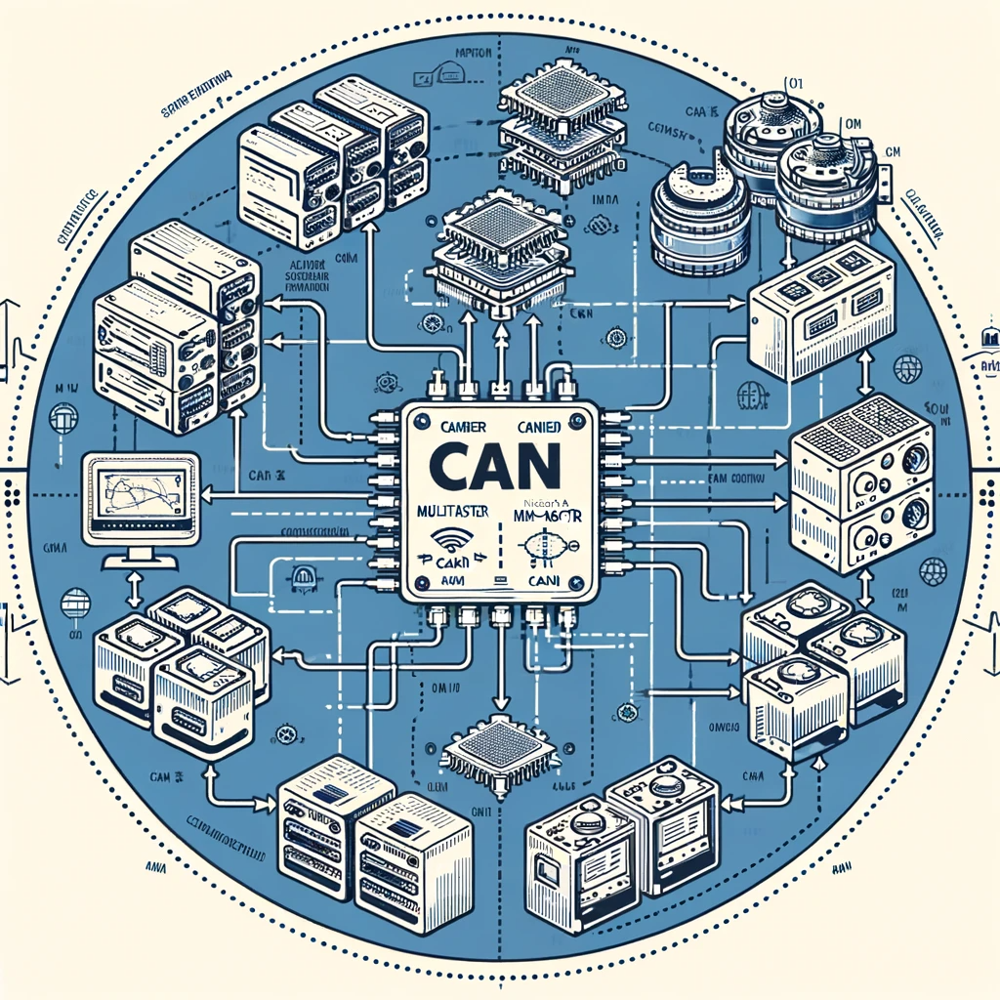
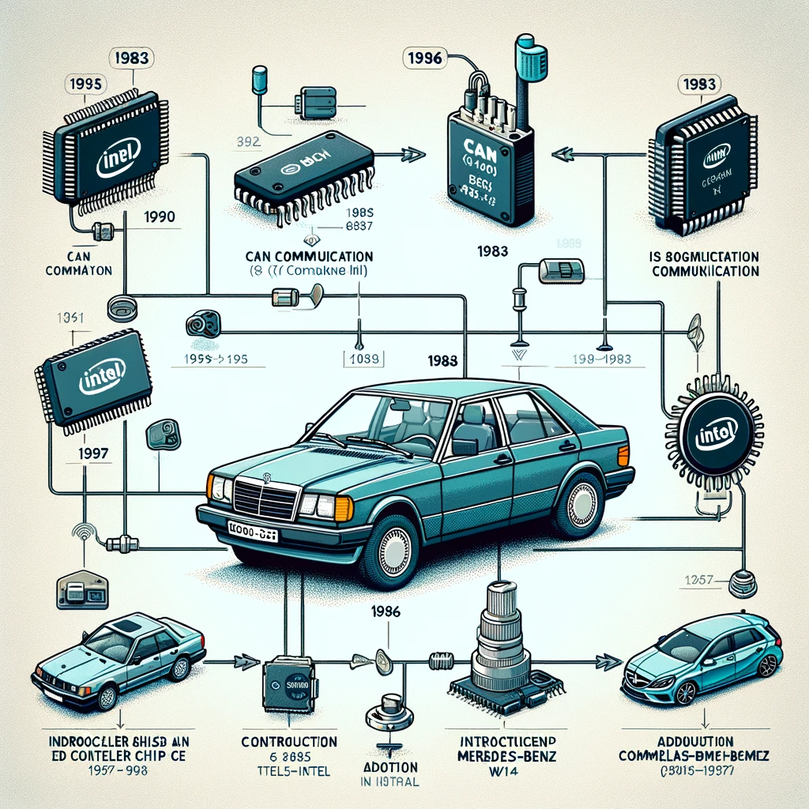

# CAN Communication Basics

This section covers the fundamental concepts, history, and importance of CAN (Controller Area Network) communication.


**Good to know:** CAN communication plays a crucial role in in-vehicle networks, industrial automation systems, and various other contexts.


## What is CAN Communication?

CAN communication is a message-based protocol, designed originally for multiplex electrical wiring within automobiles to save on copper, but it is also used in many other contexts. It enables reliable data exchange between various devices without a host computer.

### History of CAN Communication

Development of the CAN bus started in 1983 at Robert Bosch GmbH. The protocol was officially released in 1986 at the Society of Automotive Engineers (SAE) conference in Detroit, Michigan. The first CAN controller chips were introduced by Intel in 1987, followed by Philips. The Mercedes-Benz W140 was the first production vehicle to feature a CAN-based multiplex wiring system.

Bosch published several versions of the CAN specification, with the latest being CAN 2.0 in 1991, which has two parts: Part A for the standard format with an 11-bit identifier, and Part B for the extended format with a 29-bit identifier.

In 1993, the International Organization for Standardization (ISO) released CAN standard ISO 11898, which was later restructured into two parts covering the data link layer and the physical layer for high-speed CAN. ISO 11898-3, released later, covers the CAN physical layer for low-speed, fault-tolerant CAN.

In 2012, Bosch released CAN FD 1.0, or CAN with Flexible Data-Rate, which is compatible with existing CAN 2.0 networks.

### Basic Principles of CAN Communication

CAN communication uses a multi-master serial bus standard, where each device on the network has the authority to transmit messages. Unique identifiers (IDs) are used to determine message priority and prevent data collision.

### Advantages of CAN Communication

- High reliability and error resilience
- Low cost and simple wiring
- Efficient data transmission

### Limitations of CAN Communication

- Limited data transmission speed
- Restrictions on message length
- Complexity in network design

## Applications of CAN Communication

- **Automotive**: Used in passenger vehicles, trucks, buses, and agricultural equipment.
- **Industrial Automation**: Applied in factory automation, mechanical control, and building automation.
- **Medical Instruments**: Utilized in complex medical equipment for reliable communication.
- **Other Fields**: Including aviation, maritime applications, lighting control systems, and robotics.

## Conclusion

CAN communication's versatility and robustness have led to its wide adoption in various fields beyond automotive. Its continual development, like the introduction of CAN FD, ensures its relevance in modern technology applications.

_Reference: [More Detailed Information on CAN Communication](link address)_
