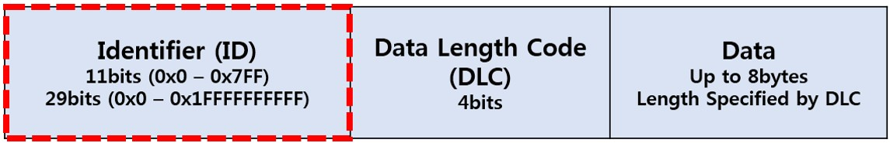

# CAN Basics

## \[ What is CAN? ]

CAN(Controller Area Network)이란, 차량 내에서 호스트 컴퓨터 없이 마이크로 컨트롤러나 장치들이 서로 통신하기 위해 설계된 **표준 통신 규격**입니다. **차량 내 \*ECU(Electronic control unit)들은 CAN 프로토콜을 사용하여 통신**합니다. 초기에는 차량 네트워크용으로 개발되었으나 최근에는 차량뿐만 아니라 산업 전 분야에 폭넓게 적용되고 있으며, 기본적인 시스템 구성은 아래와 같습니다.

<figure><figcaption>
(출처 : CAN 통신의 이해 - 기술블로그)
</figcaption></figure>

## \[ History of CAN ]

CAN은 **Bosch가 1985년에 차량 내 네트워크를 위해 개발**했습니다. 과거에 자동차 제조업체는 점대점 배선 시스템을 사용하여 차량 내 전자 장치를 연결했습니다. 제조업체는 자동차에서 점점 더 많은 전자 장치를 사용하기 시작했으며, 크고 무겁고 비싼 배선 하네스가 사용되었습니다. 그 후에는 전용 배선을 차량 내 네트워크로 교체하여 배선 비용, 복잡성 및 무게를 줄였습니다.&#x20;

지능형 디바이스 네트워킹을 위한 고정밀 직렬 버스 시스템인 CAN은 표준 차내 네트워크로 부상했습니다. 자동차 산업은 빠르게 CAN를 도입했고, 1993년에는 ISO 11898이라는 국제 표준이 되었습니다. 1994년부터 **CANopen 및 DeviceNet과 같은 몇 가지 상위 레벨 프로토콜이 CAN 위에 표준화**되었습니다. 다른 시장에서는 이러한 추가 프로토콜을 널리 채택했으며, 이는 현재 산업용 통신의 표준입니다. 이 백서는 차량 내 네트워크로서의 CAN에 중점을 둡니다.

## \[ CAN Adventage ]

### 1. 저비용, 경량 네트워크

CAN은 여러 CAN 디바이스간 통신을 위한 **경제적이며 안정적인 네트워크를 제공**합니다. 이 방법의 장점은 전자 제어 유닛(ECU)이 시스템의 모든 디바이스에 대한 아날로그 및 디지털 입력을 가져야 하는 것이 아니라 **단일 CAN 인터페이스만 가지면 된다는 점**입니다. 따라서 자동차 전체 비용이 절감되며 무게도 줄어듭니다.&#x20;

<figure><figcaption>
(출처 : CAN 개요 - National Instrument)
</figcaption></figure>

### 2. 브로드캐스트 통신

네트워크의 각 디바이스에는 CAN 컨트롤러 칩이 있고, 따라서 지능적입니다. 네트워크의 모든 디바이스는 전송되는 모든 메시지를 볼 수 있습니다. 각 디바이스는 메시지가 중요한지, 아니면 제거해도 되는지 결정합니다.  이 구조에서는 **최소한의 영향으로 CAN 네트워크를 수정**할 수 있습니다.  네트워크를 수정하지 않고도 비전송 노드를 추가할 수 있습니다.

### 3. 우선순위

**CAN은 다중통신망(Multi Master Network)이며 CSMA/CD+AMP(Carrier Sense Multiple Access/Collision Detection with Arbitration on Message Priority) 방식을 이용합니다.**&#x20;

먼저 CAN 노드에 메시지를 보내기 전에 CAN 버스라인이 사용 중인지를 파악합니다. 또한 메시지 간 충돌 검출을 수행합니다. 이 때 어떠한 노드로부터 보내진 메시지는 송신측이나 수신측의 주소를 포함하지 않습니다. 즉 주소지정방식으로 통신하지 않습니다. 대신 메시지의 처음부분에 CAN 네트워크상에서 각각의 노드를 식별할 수 있도록 **각 노드마다 유일한 식별자(ID-11bits 또는 29bits)**를 가지고 있습니다.&#x20;

<figure><figcaption>
(출처 : CAN 통신의 이해 - 기술블로그)
</figcaption></figure>

네트워크상에 연결된 모든 노드는 네트워크상에 있는 메시지를 수신한 후 **자신이 필요로 하는 식별자의 메시지인 경우에만 받아들이고**, 그렇지 않은 경우의 메시지는 무시합니다. 네트워크상(CAN 통신 라인)에 흘러 다니는 여러 노드의 데이터들이 동시에 사용자가 필요로 하는 노드로 유입되는 경우에는 식별자의 숫자를 비교하여 먼저 받아들일 메시지의 우선순위를 정하는데, 식별자의 숫자가 낮을수록 우선순위가 높습니다.&#x20;

**우선순위가 높은 메시지가 CAN 버스의 사용 권한을 보장**받으며 이때 낮은 순위의 메시지는 자동적으로 다음 버스 사이클에 재전송이 되도록 합니다. 각 CAN 메시지는 11비트의 식별자(CAN 2.0A), 또는 29비트의 식별자(CAN 2.0B)를 가지며, CAN 메시지의 맨 처음 시작부분에 위치(그림 3 참조)합니다. **이러한 식별자는 네트워크가 결정성 있는 타이밍 제약을 충족할 수 있도록 합니다.**

### 4. 에러 기능

CAN 스펙에는 각 프레임의 내용의 에러를 확인하도록 **CRC(Cyclic Redundancy Code)가 포함**되어 있습니다.  에러가 있는 프레임은 모든 노드에 의해 무시되며, 에러 프레임을 전송하여 네트워크에 에러를 신호할 수 있습니다. 이것은 실시간으로 결함이 있는 노드를 감지해 해당 노드를 비활성화함으로써 **네트워크의 신뢰성을 보장**합니다.\

## \[ CAN Disaventage ]

* **전기적 부하로 인한 장치 연결 제한**: 전기적 부하 때문에 연결 가능한 장치의 수는 최대 64개 노드로 제한됩니다.
* **케이블 길이 제한**: 케이블 길이는 40미터(약 131피트)로 제한되어 있으며, 대부분의 사용 사례에서는 문제가 되지 않지만 일부 응용 프로그램에서는 제한이 될 수 있습니다.
* **속도 제한**: 표준에 따르면 최대 속도는 1 Mbit/초로 일부 시스템에 따라 사용에 제한이 있을 수 있습니다.
* **과도한 전기적 잡음 발생**: CAN은 과도한 전기적 잡음을 발생시킬 수 있습니다.
* **소프트웨어 개발 및 유지 보수 비용**: CAN은 일부 비용을 절감하지만, 소프트웨어 개발 및 유지 보수 비용이 높을 수 있습니다.

##

## \[ Conclusion ]

* 배선의 증가로 인한 여러 문제점을 해결하기 위해 CAN 등장
* 하나의 CAN BUS 네트워크에 여러 ECU들이 연결되어 있음
* CAN BUS 네트워크를 통해 각 노드(ECU)들은 서로 메시지를 주고받음
* 메시지의 우선순위에 따라 할당된 유일한 식별자(ID)를 이용해 메시지를 구별함
* CAN BUS 네트워크에 두 개의 노드에서 메시지가 동시에 전송되려고 할 때, 더 높은 우선순위(더 낮은 ID번호)를 가진 노드의 메시지가 먼저 전송됨

## \[ 내용 및 이미지 출처 ]







\
