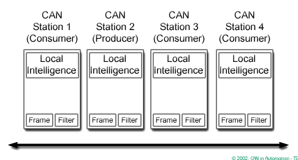
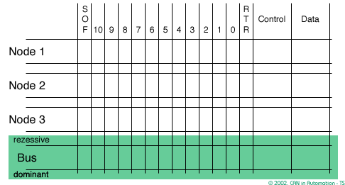
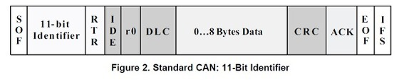

# CAN Protocol

**CAN**은 국제 표준화 기구(ISO)에 의해 정의된 직렬 통신 버스로, 원래 자동차 산업을 위해 복잡한 배선 대신 두 개의 전선 버스로 대체하기 위해 개발되었습니다.

CAN 통신 프로토콜, **ISO 11898**은 네트워크 상의 장치들 사이에서 정보가 어떻게 전달되는지를 설명하며, **OSI(Open Systems Interconnection) 모델의 계층적 구조에 따라 정의**됩니다.

실제 장치 간의 통신은 모델의 물리 계층에 의해 정의됩니다. ISO 11898 아키텍처는 OSI/ISO 모델의 일곱 계층 중 가장 낮은 두 계층인 **데이터 링크 계층**과 **물리 계층**으로 정의합니다.

<figure><figcaption></figcaption></figure>

**응용 계층**은 상위 수준의 애플리케이션 특정 프로토콜로의 통신 링크를 설정합니다. 이러한 프로토콜 중 하나로는 벤더 독립적인 CAN open 프로토콜이 있으며, 이는 국제 사용자 및 제조업체 그룹인 CAN in Automation (CIA)에 의해 지원됩니다.

***

## \[ Physical Layer ]&#x20;


**물리 계층**은 네트워크 통신의 하드웨어 측면을 담당합니다. 이 계층은 전기적 신호, 타이밍, 케이블의 물리적 특성, 커넥터 유형 등 통신에 필요한 물리적 매체와 하드웨어 인터페이스에 대한 표준을 정의합니다


### 1. Bus Length vs Signaling Rate

<table data-full-width="true"><thead><tr><th align="center">Bus Length(m)</th><th align="center">Signaling Rate(m)</th></tr></thead><tbody><tr><td align="center">40</td><td align="center">1</td></tr><tr><td align="center">100</td><td align="center">0.5</td></tr><tr><td align="center">200</td><td align="center">0.25</td></tr><tr><td align="center">500</td><td align="center">0.10</td></tr><tr><td align="center">1000</td><td align="center">0.05</td></tr></tbody></table>

**CAN 네트워크의 최대 버스 길이는 신호 속도에 따라 달라집니다.** 전송 거리가 증가함에 따라 신호 속도는 감소합니다. 주요 제한 요인은 케이블 대역폭 제한으로, 이는 신호 전환 시간을 저하시키고 기호 간 간섭을 일으킵니다. 1000미터 길이의 버스에서 안전하게 사용할 수 있는 신호 속도는 약 50kbps입니다.&#x20;

$$Signaling Rate (Mbps) × Bus Length (m) ≤ 50$$

이러한 안전 여유를 통해 시스템 변화가 발생해도 통신이 중단되지 않습니다. 노드 수가 많고 케이블 길이가 긴 경우, 더 높은 품질의 케이블이나 CAN 버스 중계기 사용이 필요할 수 있습니다. 그러나 실제로는 거의 모든 종류의 케이블이 짧은 거리에서는 어느 정도까지는 작동합니다.

### 2. Cables

비차폐된 120-Ω 케이블이 많은 응용 프로그램에서 사용되지만, CAN 트랜시버를 사용하는 데이터 전송 회로는 광범위한 **공통 모드 전압 범위**에서 견고한 연결이 필요한 작업에 사용됩니다. 따라서, 이러한 전자적으로 가혹한 환경에서는 Belden Cable 3105A와 같은 **차폐 케이블이 권장**됩니다.&#x20;

<figure><figcaption>
<strong>차폐 케이블</strong>
</figcaption></figure>

 

<figure><figcaption>
<strong>비차폐 케이블</strong>
</figcaption></figure>


"**공통 모드 전압**"은 이 두 선이 동일하게 영향을 받는 전압 변화를 말합니다. 예를 들어, 두 선 모두 동시에 2V 증가하면, 이는 공통 모드 전압 변화입니다. "공통 모드 전압 범위"는 이러한 공통 모드 변화가 **시스템에서 안정적으로 처리될 수 있는 전압 범위**를 의미합니다. 따라서 이 범위 내에서는 외부 간섭에 의한 영향이 최소화되며, 신호 전송의 정확성이 유지됩니다.


### 3. Grounding

<figure><figcaption></figcaption></figure>

CAN 통신에서 접지(Ground)를 연결하는 주된 이유는 **전기적 노이즈와 간섭을 최소화하고, 시스템의 전기적 안정성을 높이기 위함**입니다. CAN 시스템은 차량과 같이 전기적 노이즈가 많은 환경에서도 안정적으로 작동해야 하며, 접지는 이러한 노이즈로부터 시스템을 보호합니다. 또한, 접지 연결은 CAN 네트워크의 다양한 구성 요소 간에 공통의 참조 전압을 제공하여, 신호 무결성을 유지하는 데 도움이 됩니다. **연결하지 않아도 통신이 가능**할 수 있지만, 안정적인 통신을 위해서는 접지 연결이 권장됩니다.\

### 4.Line Terminations

CAN (Controller Area Network) 통신에서 양쪽 끝에 **120-Ω의 저항을 설치하는 이유는 전송선로의 반사파(reflections)를 최소화하기 위해서**입니다. 이러한 반사파는 신호의 왜곡이나 간섭을 일으킬 수 있으며, 특히 높은 데이터 전송 속도에서 더욱 문제가 됩니다.

CAN 네트워크는 다수의 노드(node)가 트위스티드-페어 케이블을 통해 연결되는 버스 구조를 가지고 있습니다. 이러한 구조에서 신호는 케이블을 따라 양쪽 방향으로 전파됩니다. 케이블의 끝에 도달하면, 신호는 반사되어 다시 돌아옵니다. 이 **반사된 신호는 원래 신호와 중첩되어 간섭을 일으킬 수 있습니다.**

120-Ω의 저항을 케이블의 양쪽 끝에 설치함으로써, 케이블의 특성 임피던스와 일치시키게 됩니다. 특성 임피던스란 케이블이 전기 신호를 전송할 때 나타내는 저항값을 의미합니다. 케이블의 특성 임피던스와 종단 저항이 일치하면, 신호는 **케이블 끝에서 반사되지 않고 저항에 의해 흡수**됩니다. 이렇게 함으로써 신호의 반사를 최소화하고, 데이터 전송의 신뢰성을 높일 수 있습니다.&#x20;

<figure><figcaption>
120Ohm 설치 여부 결과 사진
</figcaption></figure>

### 5. Connectors

**일반적인 CAN 통신 커넥터 (참고용)**

<figure><figcaption>
9-pin DSUB
</figcaption></figure>

<figure><figcaption>
5-Pin Mini-Connector
</figcaption></figure>

## \[ Data Link Layer ]


**데이터 링크 계층**은 네트워크 장비 간의 신뢰성 있는 데이터 전송을 보장합니다CAN 통신에서 데이터 링크 계층은 프레임의 형식, 프레임 내 식별자의 우선 순위 결정, 오류 탐지 및 신호 방식 등을 규정합니다.


### 1.  Principles of data exchange

<figure><figcaption></figcaption></figure>

클래식 CAN은 **"브로드캐스트 통신 메커니즘"**을 기반으로 합니다. 모든 클래식 CAN 데이터 프레임은 네트워크 전체에서 고유해야 하는 식별자를 제공합니다. 이 식별자는 내용을 나타내고 네트워크 접근 우선순위를 정의합니다. 이는 여러 네트워크 참여자들이 네트워크 접근을 위해 경쟁할 때 중요합니다

기존 네트워크에 클래식 CAN 노드를 추가하는 것은 새로운 클래식 CAN 노드가 수신기만일 경우 현재의 클래식 CAN 노드에 대한 **하드웨어나 소프트웨어 수정 없이 쉽게 할 수 있습니다**. 이를 통해 모듈러 개념을 허용하며, 다중 데이터 수신 및 분산된 프로세스의 동기화를 가능하게 합니다.

### 2. Real-time data transmission

실시간 처리에서 네트워크를 통해 교환되는 데이터의 긴급성은 크게 달라질 수 있습니다. 예를 들어, 빠르게 변하는 차원(예: 엔진 부하)은 다른 차원(예: 엔진 온도)보다 더 자주 전송되므로 지연이 덜합니다.

데이터 프레임이 다른 덜 긴급한 데이터 프레임에 비해 **어떤 우선 순위로 전송되는지는 할당된 CAN 식별자에 의해 결정**됩니다. 이러한 우선 순위는 시스템 설계 중에 할당됩니다. CAN 식별자는 11비트 또는 29비트 이진값으로 구성됩니다. 가장 낮은 값이 가장 높은 우선순위를 가지며, 식별자 값이 높을수록 우선 순위는 낮아집니다.

<figure><figcaption></figcaption></figure>

여러 데이터 또는 원격 프레임이 동시에 네트워크 접근을 경쟁하는 경우, 네트워크 접근은 경쟁 중인 데이터 또는 원격 프레임의 **CAN 식별자를 비트 단위로 비교하여 협상됩니다.** 이 메커니즘을 '**비트 단위 중재**'라고 합니다. 네트워크 참여자(노드)들은 설정된 샘플 포인트에서 비트 단위로 신호 수준을 관찰합니다.

이는 우세한 상태가 열세한 상태를 덮어쓰는 '**와이어드-앤드 메커니즘**'에 따라 일어납니다. 열세한 전송과 우세한 관찰을 하는 모든 노드들은 네트워크 접근 경쟁에서 패배합니다. 이러한 '패자'들은 자동적으로 현재 전송되고 있는 가장 높은 우선순위를 가진 **CAN 데이터 프레임의 수신자가 됩니다**. 그들은 현재 전송이 완료되고 네트워크가 다시 사용 가능해지면 자신의 CAN 데이터 프레임을 전송하려고 시도합니다.

### 3. CAN data frame formats

<figure><figcaption></figcaption></figure>

<table><thead><tr><th width="115.33333333333331" align="center">Field</th><th width="80" align="center">bit</th><th align="center">Function</th></tr></thead><tbody><tr><td align="center"><strong>SOF</strong></td><td align="center">1</td><td align="center">프레임 시작을 알리고 모든 노드를 프레임 전송을 위해 동기화합니다</td></tr><tr><td align="center"><strong>IDENTIFIER</strong></td><td align="center">11</td><td align="center">프레임 내용과 우선순위 결정</td></tr><tr><td align="center"><strong>RTR</strong></td><td align="center">1</td><td align="center">데이터 프레임과 원격 프레임 구별</td></tr><tr><td align="center"><strong>IDE</strong></td><td align="center">1</td><td align="center">베이스 프레임 형식과 확장 프레임 형식 구별</td></tr><tr><td align="center"><strong>r0</strong></td><td align="center">1</td><td align="center">향후 CAN 프로토콜의 발전에 따라 새로운 기능을 위한 공간으로 활용될 수 있는 예약된 1비트입니다.</td></tr><tr><td align="center"><strong>DLC</strong></td><td align="center">4</td><td align="center">데이터 필드의 길이를 나타냄</td></tr><tr><td align="center"><strong>DATA</strong></td><td align="center">64</td><td align="center">애플리케이션 데이터 전송</td></tr><tr><td align="center"><strong>CRC</strong></td><td align="center">16</td><td align="center">데이터 무결성 검증</td></tr><tr><td align="center"><strong>ACK</strong></td><td align="center">2</td><td align="center">수신 노드가 프레임을 올바르게 받았음을 확인</td></tr><tr><td align="center"><strong>EOF</strong></td><td align="center">7</td><td align="center">데이터 프레임 또는 원격 프레임의 끝을 표시</td></tr><tr><td align="center"><strong>IFS</strong></td><td align="center">미정</td><td align="center">프레임 사이의 최소 시간 간격 정의</td></tr></tbody></table>


**Extended Format**은 프로젝트에서 사용하지 않았기 때문에 다루지 않았습니다


### 4. Detecting and signaling errors

1.  **순환 중복 검사 (CRC)**

    CRC는 CAN 프레임에 추가된 프레임 체크 시퀀스(FCS)를 통해 데이터 무결성을 보장합니다. 수신측에서는 이 FCS를 재계산하고 비교하여 일치 여부를 확인합니다. 불일치 시 CRC 오류가 발생했음을 나타냅니다.
2.  **프레임 검사**

    프레임 검사는 전송된 프레임의 구조가 고정된 형식과 크기에 부합하는지 검증합니다. 형식에 맞지 않는 경우 '형식 오류'로 지정되며, 이는 프레임이 적절하게 구성되지 않았음을 의미합니다.
3.  **ACK 오류**

    수신 노드는 정상적으로 프레임을 수신하였음을 인정 신호로 표시합니다. 전송 노드가 이 인정 신호를 받지 못하면, ACK 오류가 발생했음을 나타냅니다.
4.  **비트 모니터링**

    전송 노드는 전송한 신호와 네트워크 상의 신호를 모니터링하여 일치 여부를 확인합니다. 일치하지 않는 경우, 오류가 발생했음을 감지합니다.
5.  **비트 스터핑**

    같은 비트가 연속적으로 반복될 때, 오류를 방지하기 위해 추가적인 비트를 삽입하는 방식입니다. 이는 신호의 정확한 동기화를 위해 필요하며, 수신 노드에서는 이 추가된 비트를 제거합니다.


위에 언급된 오류 중 하나라도 감지된 경우, 적어도 한 노드에 의해 현재 진행 중인 전송은 "**오류 프레임**"을 보내며 중단됩니다. . 오류 프레임 전송 후, 수신기는 중단된 데이터 프레임의 재전송을 기대합니다. 잘못된 노드가 영구적으로 CAN 통신을 방해하지 않도록, 정교한 고장 격리 기능은 해당 잘못된 노드가 CAN 인터페이스를 끄도록 합니다 (**CAN 오류 상태; BUS - OFF** )


## \[ Appliacation Layer ]

응용 계층은 상위 레벨의 응용 프로그램 특화 프로토콜과의 통신 링크를 설정합니다.

* **정의**: 상위 레벨의 응용 프로그램 특화 프로토콜과의 통신을 담당합니다.
* **예시**: 벤더 독립적인 CAN open 프로토콜 같은 특정 응용 프로그램 프로토콜 지원.
* **역할**: 사용자 및 제조업체 그룹 CAN in Automation (CIA)에 의해 지원되는 프로토콜을 사용하여 통신합니다.

## \[ 내용 및 이미지 출처 ]






Control Area Network Physical Layer Requirements


