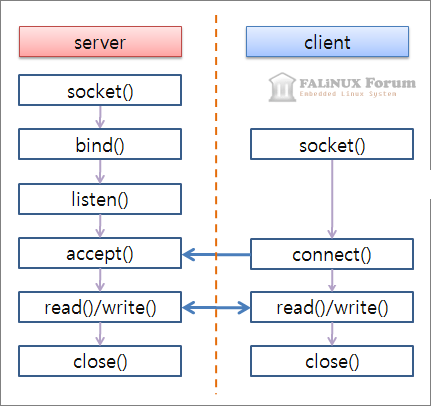
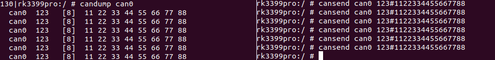

---
layout:
  title:
    visible: true
  description:
    visible: true
  tableOfContents:
    visible: true
  outline:
    visible: true
  pagination:
    visible: true
---

# CAN Programming

## \[ SocketCAN Lib]

<div data-full-width="true">

<figure><figcaption><p>Basic Socket Communication</p></figcaption></figure>

</div>

SocketCAN 패키지는 **리눅스용 CAN(Controller Area Network) 프로토콜의 구현체**입니다. CAN은 자동화, 임베디드 장치 및 자동차 분야에서 널리 사용되는 네트워킹 기술입니다. 리눅스 기반의 다른 CAN 구현체들이 문자 장치를 기반으로 했던 반면, SocketCAN은 Berkeley 소켓 API와 리눅스 네트워크 스택을 사용하며, CAN 장치 드라이버를 네트워크 인터페이스로 구현합니다. **CAN 소켓 API는 네트워크 프로그래밍에 익숙한 프로그래머들이 쉽게 CAN 소켓 사용 방법을 배울 수 있도록** TCP/IP 프로토콜과 가능한 한 유사하게 설계되었습니다.


### 1. SocketCAN 설치

```bash
sudo apt-get install can-utils
```

### 2. Opening and binding to a CAN socket

무엇보다 먼저 소켓을 생성  해야입합니다. 이 함수는 세 가지 매개변수를 받습니다 – 도메인/프로토콜 패밀리 (PF\_CAN), 소켓 타입 (원시 또는 데이터그램), 그리고 소켓 프로토콜. 성공적으로 수행되면, 함수는 **파일 디스크립터를 반환**합니다.

```cpp
int s;

if ((s = socket(PF_CAN, SOCK_RAW, CAN_RAW)) < 0) {
   perror("Socket");
   return 1;
}
```


**파일 디스크립터는 운영 체제가 파일이나 소켓 같은 리소스에 접근하는 데 사용하는 추상화된 핸들입니다.** 리눅스와 유닉스 시스템에서 파일 디스크립터는 **정수 값으로 표현**되며, 특정 파일이나 네트워크 연결을 나타냅니다. 예를 들어, `socket()` 함수는 성공적으로 소켓을 생성하면 **해당 소켓에 대한 파일 디스크립터를 반환**합니다. 이 디스크립터는 나중에 소켓에 데이터를 쓰거나 읽을 때, 그리고 소켓을 닫을 때 사용됩니다.


***

다음으로, 사용하려는 인터페이스 이름 (can0, can1, vcan0 등)에 대한 **인터페이스 인덱스를 검색**해야 합니다. 이를 위해 I/O 제어 호출을 보내고 ifreq 구조체에 인터페이스 이름을 포함합니다

```cpp
struct ifreq ifr;

strcpy(ifr.ifr_name, "vcan0" );
ioctl(s, SIOCGIFINDEX, &ifr);
```


**인터페이스 인덱스**는 네트워크 인터페이스를 고유하게 식별하는 **정수 값**입니다. 리눅스 시스템 내에서 각 네트워크 인터페이스(예: Ethernet, Wi-Fi, 가상 네트워크 등)는 **고유한 인덱스 값을 가집니다**. `ioctl()` 함수와 `ifreq` 구조체를 사용하여 특정 인터페이스 이름(예: "eth0", "can0")에 해당하는 인터페이스 인덱스를 검색할 수 있습니다.


***

인터페이스 인덱스를 알게 된 후, 이제 소켓을 CAN 인터페이스에 **바인딩**할 수 있습니다

```cpp
struct sockaddr_can addr;

memset(&addr, 0, sizeof(addr));
addr.can_family = AF_CAN;
addr.can_ifindex = ifr.ifr_ifindex;

if (bind(s, (struct sockaddr *)&addr, sizeof(addr)) < 0) {
   perror("Bind");
   return 1;
}
```


**바인딩은 소켓을 특정 네트워크 인터페이스에 연결하는 과정을 의미합니다.** `bind()` 함수를 사용하여 이를 수행할 수 있습니다. 이 함수는 소켓 파일 디스크립터, `sockaddr` 구조체(주소 정보를 담고 있음) 그리고 구조체의 크기를 인자로 받습니다. `sockaddr_can` 구조체는 CAN 네트워크를 위해 사용되며, `can_family`에는 `AF_CAN`을, `can_ifindex`에는 앞서 언급한 인터페이스 인덱스를 설정합니다. **`bind()` 호출은 소켓을 이 인터페이스에 '바인딩'하며, 이후 이 소켓을 통한 모든 통신은 해당 인터페이스를 통해 이루어집니다.**


### 3. Sending a frame

CAN 프레임을 보내기 위해서는 **can\_frame 구조체를 초기화하고 데이터로 채워야 합니다**. 기본 can\_frame 구조체는 include/linux/can.h에 정의되어 있으며 다음과 같습니다:

```cpp
struct can_frame {
    canid_t can_id;  /* 32 bit CAN_ID + EFF/RTR/ERR flags */
    __u8    can_dlc; /* frame payload length in byte (0 .. 8) */
    __u8    __pad;   /* padding */
    __u8    __res0;  /* reserved / padding */
    __u8    __res1;  /* reserved / padding */
    __u8    data[8] __attribute__((aligned(8)));
};
```

아래에서는 ID가 0x555이고, "hello"라는 5바이트 페이로드를 포함하는 CAN 프레임을 초기화하고 **write() 시스템 호출을 사용하여 보냅니다**

```cpp
struct can_frame frame;

frame.can_id = 0x555;
frame.can_dlc = 5;
sprintf(frame.data, "Hello");

if (write(s, &frame, sizeof(struct can_frame)) != sizeof(struct can_frame)) {
   perror("Write");
   return 1;
}
```

### 4. Reading a frame

프레임을 읽으려면 `can_frame`을 초기화하고 `read()` 시스템 호출을 사용합니다. 이는 프레임이 사용 가능할 때까지 차단됩니다. 예제에서는 ID, 데이터 길이 코드(DLC) 및 페이로드를 표시합니다.

```cpp
int nbytes;
struct can_frame frame;

nbytes = read(s, &frame, sizeof(struct can_frame));

if (nbytes < 0) {
   perror("Read");
   return 1;
}

printf("0x%03X [%d] ",frame.can_id, frame.can_dlc);

for (i = 0; i < frame.can_dlc; i++)
   printf("%02X ",frame.data[i]);

printf("\r\n");
```

### 5. Setting up a filter

읽기 외에도 관련 없는 CAN 프레임을 필터링할 수 있습니다. 이는 드라이버 수준에서 발생하며, 사용자 모드 애플리케이션에서 각 프레임을 읽는 것보다 더 효율적일 수 있습니다.

필터를 설정하려면 하나의 `can_filter` 구조체 또는 구조체 배열을 초기화하고 `can_id` 및 `can_mask`를 채웁니다. 그런 다음 `setsockopt()`를 호출합니다:

```cpp
struct can_filter rfilter[1];

rfilter[0].can_id   = 0x550;
rfilter[0].can_mask = 0xFF0;
//rfilter[1].can_id   = 0x200;
//rfilter[1].can_mask = 0x700;

setsockopt(s, SOL_CAN_RAW, CAN_RAW_FILTER, &rfilter, sizeof(rfilter));
```

### 6. Closing the socket

마지막으로, 소켓을 더 이상 **사용할 필요가 없다면 닫습니다**

```cpp
if (close(s) < 0) {
   perror("Close");
   return 1;
}
```

### 예제: CAN 메시지 송수신


```cpp
#include <linux/can.h>
#include <linux/can/raw.h>
#include <sys/socket.h>
#include <unistd.h>

int main() {
    int s; // CAN raw socket
    struct sockaddr_can addr;
    struct can_frame frame;
    struct ifreq ifr;

    // 소켓 생성
    s = socket(PF_CAN, SOCK_RAW, CAN_RAW);

    // 인터페이스 설정
    strcpy(ifr.ifr_name, "can0");
    ioctl(s, SIOCGIFINDEX, &ifr);

    addr.can_family = AF_CAN;
    addr.can_ifindex = ifr.ifr_ifindex;

    // 소켓 바인딩
    bind(s, (struct sockaddr *)&addr, sizeof(addr));

    // CAN 프레임 송신
    frame.can_id = 0x123;
    frame.can_dlc = 2;
    frame.data[0] = 0x11;
    frame.data[1] = 0x22;
    
    write(s, &frame, sizeof(frame));
    //read(s, &frame, sizeof(frame));
    
    // 소켓 닫기
    close(s);

    return 0;
}
```


## \[ CAN Utils ]

Linux에서 **command line 창을 사용**하여쉽게 SocketCAN을 사용해볼 수 있는 도구

### 1. 설치

```bash
sudo apt-get install can-utils
```

### 2. 설정

```bash
# 통신속도 및 포트 활성화
sudo ip link set can0 type can bitrate 500000    
sudo ifconfig can0 up
```

### 3. 포트 확인

```bash
# CAN 포트 확인
sudo ifconfig -a | grep can

# CAN 포트 상세
ip -d -s link show can0 
```

### 4. 송수신

```bash
# CAN 메세지 수신 상태 유지
candump can0
# CAN 메세지 송신 
# CAN id = 0x001,DLC = 6,data[] = 0xFF, 0xFF, 0xFF, 0xFF, 0xFF, 0xFF
cansend can0 001#FFFFFFFFFFFF
```

<figure><figcaption><p>송수신 모습(Loop back)</p></figcaption></figure>

## \[ 내용 및 이미지 출처 ]






